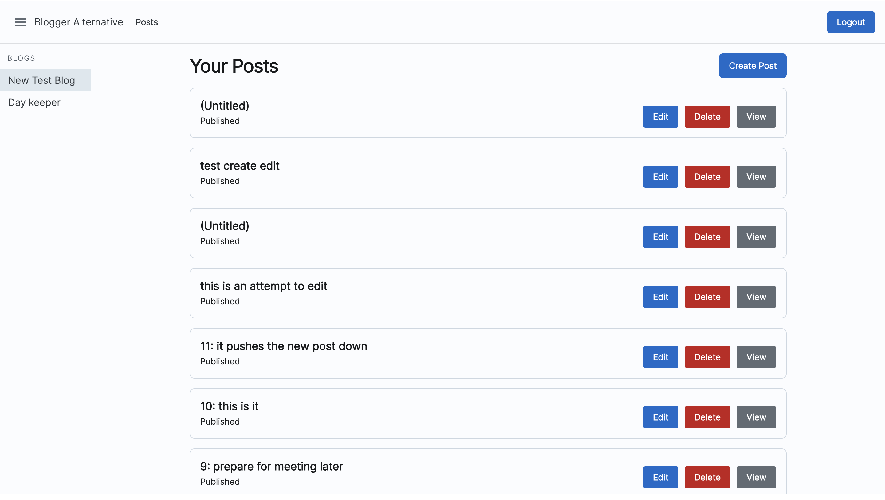

# Blogger Alternative

This project is started to develop a web application with a better blog editing experience than the current Google Blogger web application. It will involve more keyboard shortcuts and integrate Markdown support.

## Current features

- An editor that has a WYSIWYG (What you see is what you get) mode and a Markdown editor mode
- Markdown support
- Ability to add screenshots to blog posts
- Autosave blog posts
- Download blog posts as Word documents

## Technology Stack

* MERN: MongoDB, Express, React, Node.js
* Frontend libraries: Joy-UI
* Bootstrapped with [Create React App](https://github.com/facebook/create-react-app).

## Contributing

### Prerequisites

1. Yarn, as the package manager of choice
2. Docker

### Setting up

1. Run `git clone https://github.com/C-likethis123/Blogger-Alternative.git` to get a working copy in your computer
2. Go to the frontend directory and run `yarn`
3. Go to the backend directory and run `yarn`

### Development

2. Go to the frontend directory and run `yarn build`
3. `cd server; yarn rebuild && yarn dockerise`
4. Access the app at localhost:8000

### Testing

To test frontend/backend, navigate to the respective folders and type `yarn test`

## Reflections

I learnt about:

- Implementing autosave features
- Implementing features to download data
- Databases: MongoDB
- Express: I learnt how to use the Express Router and how to create and use REST APIs
- Contributing to the Toast UI Text Editor repository
- Git: rebasing, amending commits, reflogging
- Creating a custom fork and pointing this project to the custom fork
- Integrating this application with Google OAuth
- Using the Google Blogger API

Ideally, there are some other things I want to learn:

- Deploying to AWS Amplify
- A frontend testing framework
- Making this a progressive web application
